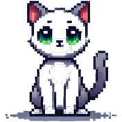

# Gato Virtual 🐈

> Un pequeño gato para tu web. Cero dependencias. Bastante personalidad.

**Gato Virtual** es una mascota web ligera, interactiva y personalizable, inspirada en los clásicos *neko* y *shimeji*.

El gato pasea por la pantalla, investiga el cursor, juega, come, duerme, maúlla, se esconde y también puede enfadarse si recibe demasiadas caricias. Porque incluso un gato de JavaScript necesita límites.

El objetivo del proyecto es ofrecer un componente sencillo, profesional, libre y divertido que pueda añadirse a cualquier página web con una sola función.



## Características

- JavaScript puro, sin dependencias.
- Integración mediante una sola función.
- Movimiento fluido con `requestAnimationFrame`.
- Estados y necesidades internas:
  - energía
  - hambre
  - aburrimiento
  - felicidad
- Comportamientos autónomos:
  - caminar
  - investigar
  - seguir el cursor
  - jugar
  - comer
  - dormir
  - esconderse
  - maullar
  - enfadarse
- Interacción mediante clics y caricias.
- Sonidos sintetizados con Web Audio API.
- Tamaño, velocidad, nombre y comportamiento configurables.
- Posibilidad de crear varios gatos.
- API pública para controlar la mascota desde la web.

## Instalación

Copia el archivo principal y la carpeta de recursos dentro de tu proyecto:

```text
gato-virtual/
├── gato-virtual.js
├── demo.html
└── assets/
    ├── gato_idle.png
    ├── gato_caminar.png
    ├── gato_comer.png
    ├── gato_dormir.png
    ├── gato_enfadado.png
    ├── gato_esonderse.png
    ├── gato_investigar.png
    ├── gato_jugar.png
    └── gato_maullar.png
```

Incluye el script antes de cerrar `</body>`:

```html
<script src="gato-virtual.js"></script>
```

Después crea la mascota:

```html
<script>
  crearGato();
</script>
```

## Uso básico

```html
<script>
  crearGato({
    nombre: "Michi",
    sonido: true
  });
</script>
```

La función devuelve la instancia del gato:

```js
const michi = crearGato({
  nombre: "Michi",
  escala: 0.9,
  velocidad: 80,
  seguirRaton: true
});

michi.alimentar();
```

También puede utilizarse directamente como clase:

```js
const luna = new GatoVirtual({
  nombre: "Luna",
  sonido: false
});
```

## Opciones

| Opción | Tipo | Valor inicial | Descripción |
|---|---:|---:|---|
| `nombre` | `string` | `"Michi"` | Nombre mostrado al pasar el cursor. |
| `assetsPath` | `string` | `"assets/"` | Ruta de la carpeta de imágenes. |
| `prefijo` | `string` | `"gato_"` | Prefijo de los archivos de sprite. |
| `extension` | `string` | `".png"` | Extensión de los sprites. |
| `tamano` | `number` | `110` | Tamaño base del gato en píxeles. |
| `escala` | `number` | `1` | Multiplicador de tamaño. |
| `velocidad` | `number` | `72` | Velocidad de movimiento en píxeles por segundo. |
| `interactivo` | `boolean` | `true` | Permite acariciar al gato mediante clic. |
| `seguirRaton` | `boolean` | `true` | Permite que investigue y siga el cursor. |
| `sonido` | `boolean` | `false` | Activa maullidos y ronroneos sintetizados. |
| `zIndex` | `number` | `999999` | Nivel visual del componente. |
| `sprites` | `object` | `null` | Permite proporcionar sprites personalizados. |
| `onEstado` | `function` | `null` | Callback ejecutado al cambiar de estado. |

## API pública

```js
const gato = crearGato();
```

| Método o propiedad | Acción |
|---|---|
| `gato.acariciar()` | Aumenta la felicidad y reduce el aburrimiento. |
| `gato.alimentar()` | Hace que el gato coma. |
| `gato.aJugar()` | Inicia una sesión de juego. |
| `gato.aDormir()` | Envía al gato a dormir. |
| `gato.hablar()` | Hace que maúlle. |
| `gato.animo` | Devuelve sus necesidades y estado actual. |
| `gato.destruir()` | Elimina la mascota y sus eventos de la página. |

Ejemplo:

```js
console.log(gato.animo);
```

```js
{
  energia: 82,
  hambre: 18,
  aburrimiento: 31,
  felicidad: 88,
  estado: "idle"
}
```

## Escuchar cambios de estado

```js
const gato = crearGato({
  nombre: "Michi",
  onEstado(estado, instancia) {
    console.log(`${instancia.cfg.nombre} ahora está: ${estado}`);
  }
});
```

## Sprites personalizados

```js
crearGato({
  sprites: {
    idle: "sprites/reposo.png",
    caminar: "sprites/paseo.png",
    comer: "sprites/comiendo.png"
  }
});
```

Los estados no incluidos seguirán cargándose desde `assetsPath`.

## Varios gatos

```js
crearGato({
  nombre: "Michi",
  escala: 1
});

crearGato({
  nombre: "Luna",
  escala: 0.75,
  velocidad: 95,
  sonido: true
});
```

El resultado puede recordar ligeramente a una invasión felina. Eso forma parte de la experiencia.

## Demo

Abre `demo.html` para ejecutar una integración mínima:

```js
crearGato({
  nombre: "Michi",
  sonido: true
});
```

## Estado del proyecto

Proyecto en desarrollo.

La versión actual ya ofrece una mascota funcional y autónoma. Las siguientes versiones podrán ampliar la personalización, los comportamientos, la accesibilidad y las herramientas de integración.

> Nota: el archivo `gato_esonderse.png` conserva actualmente el nombre utilizado por el código.

## Licencia

Proyecto creado para uso libre y gratuito.

La licencia concreta deberá indicarse en el archivo `LICENSE` antes de publicar una versión estable.

## Contribuciones

Las propuestas, correcciones y nuevas ideas son bienvenidas.

Puedes abrir un *issue* o enviar un *pull request*. Procura que cada cambio mantenga los tres principios del proyecto:

1. Integración sencilla.
2. Código claro.
3. Gatos felices.
